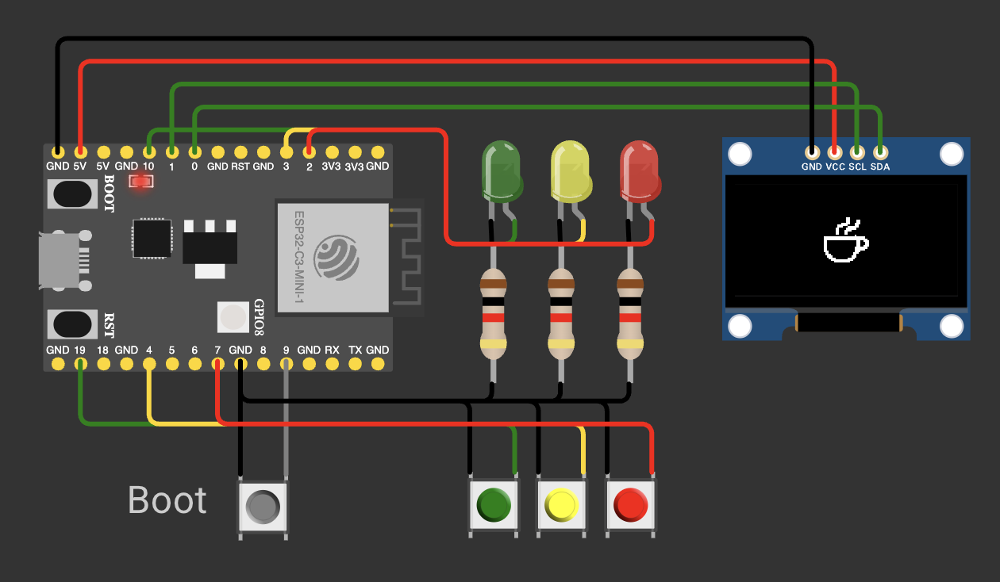
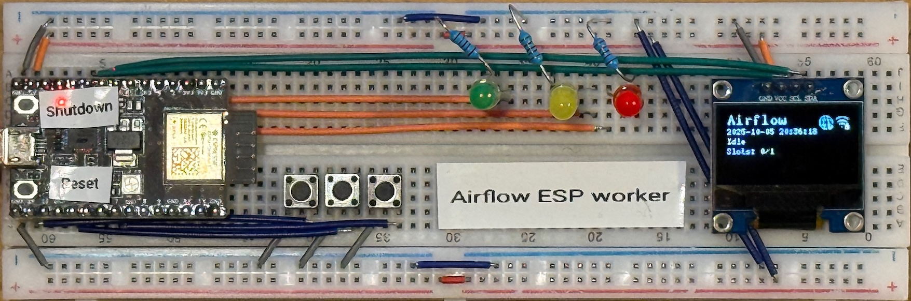

# airflow-esp

An Airflow Edge worker written in Rust, running on an ESP-C3.

## Airflow Summit 2025

* [Link to branch `airflow-summit-2025`](https://github.com/m1racoli/airflow-esp/tree/airflow-summit-2025)
* [Link to session](https://airflowsummit.org/sessions/2025/run-airflow-tasks-on-your-coffee-machine/)
* [Link to slides](https://docs.google.com/presentation/d/13mk6TB8DYVzOZYhjzufn1vSNyfls-F5Z_9pmcY7cOZQ/edit?usp=sharing)

